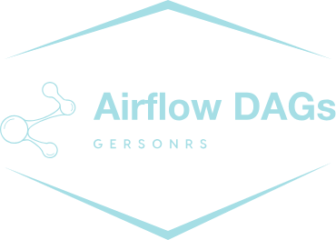

<!-- README.md -->
<!--
*** Obrigado por estar vendo o nosso README. Se você tiver alguma sugestão
*** que possa melhorá-lo ainda mais dê um fork no repositório e crie uma Pull
*** Request ou abra uma Issue com a tag "sugestão".
*** Obrigado novamente! Agora vamos rodar esse projeto incrível : D
-->

<!-- PROJECT SHIELDS -->

[](https://img.shields.io/badge/type-Open%20Project-green)
[](https://github.com/GersonRS/airflow-dags/commits/master)
[](https://github.com/GersonRS/airflow-dags/issues)
[](https://github.com/GersonRS/airflow-dags/search?l=python)
[](https://img.shields.io/github/repo-size/GersonRS/airflow-dags)
[](https://img.shields.io/github/contributors/GersonRS/airflow-dags)
[](https://img.shields.io/github/stars/GersonRS/airflow-dags)
[](LICENSE)
[](https://img.shields.io/badge/status-active-success.svg)
* [](https://github.com/GersonRS/airflow-dags/actions)

<p align="center">
  
</p>

<!-- PROJECT LOGO -->

# Airflow Dags

Esse é um repositóriode dags do airflow.

<!-- TABLE OF CONTENTS -->

# Tabela de Conteúdo
* [Tabela de Conteúdo](#tabela-de-conteúdo)
* [Objetivo](#objetivo)
* [Fluxo de versionamento](#fluxo-de-versionamento)
* [Ferramentas](#ferramentas)
* [Como Usar](#como-usar)
  + [Instalação do Cluster](#instalação-do-cluster)
  + [Instalação das Ferramentas](#instalação-das-ferramentas)
  + [Observações](#observações)
* [Estrutura do Projeto](#estrutura-do-projeto)
* [Requisitos](#requisitos)
* [Contribuição](#contribuições)
* [Licença](#licença)
* [Contato](#contato)

<!-- ABOUT THE PROJECT -->

# Objetivo

O objetivo deste repositório é fornecer as dags para o airflow atraves do gitsync.

# Fluxo de versionamento

Projeto segue regras de versionamento [gitflow](https://www.atlassian.com/br/git/tutorials/comparing-workflows/gitflow-workflow).

# Ferramentas

O repositório inclui um conjunto de ferramentas para o funcionamento das dags no airflow. Abaixo segue o que foi utilizado na criação deste projeto:

* [Python](https://www.python.org/) - Python é uma linguagem de programação de alto nível, interpretada de script, imperativa, orientada a objetos, funcional, de tipagem dinâmica e forte. Foi lançada por Guido van Rossum em 1991.

* [Poetry](https://python-poetry.org/) - O Poetry é uma ferramenta para gerenciar dependências em projetos Python. Ele pode ser usado para instalar, atualizar e remover dependências, bem como para gerenciar ambientes virtuais de desenvolvimento. O Poetry é uma alternativa moderna ao pip e ao virtualenv, que simplifica o gerenciamento de dependências e garante a reprodutibilidade do ambiente de desenvolvimento.
# Como Usar

Para usar esse repositório, basta fazer o fork deste repositório e usar como template base. O repositório resultante incluirá a estrutura básica do projeto e as ferramentas necessárias para gerenciar suas dags.

Para começar um novo projeto de dags com este template, siga as instruções abaixo:

## Instalação

faça o clone do repositório e execute a instalação das dependencias:

```sh
poetry install
```

## Observações

* Certifique-se de ter as ferramentas listadas em [Ferramentas](#ferramentas) instaladas corretamente em seu sistema.
* Para saber mais sobre cada ferramenta, consulte a documentação oficial.
* Certifique-se de testar e validar suas dags antes de implantá-los em produção. Isso ajudará a garantir que seus processos estejam funcionando corretamente e que os dados estejam sendo tratados de maneira apropriada.
# Estrutura do Projeto

A estrutura do projeto é a seguinte:

```bash
.
├── dags
│   ├── spark_jobs
│   ├── src
│   └── utils
├── data
├── include
├── plugins
└── tests
    └── dags
```

* **[dags](/dags/)** - Diretório contendo as DAGs do Airflow, responsáveis por definir fluxos de trabalho de data pipelines;
# Requisitos

Para usar este repositório, você precisa ter o Git, o Python e o Poetry instalados em seu sistema. Além disso, para rodar os testes, você precisará instalar o Docker em seu sistema. As instruções para instalar o Docker podem ser encontradas em https://www.docker.com/get-started.

# Contribuições

Contribuições são bem-vindas! Sinta-se à vontade para criar um pull request com melhorias e correções de bugs. As contribuições são o que fazem a comunidade `open source` um lugar incrível para aprender, inspirar e criar. Qualquer contribuição que você fizer será **muito apreciada**.

1. Faça um Fork do projeto
2. Crie uma Branch para sua Feature (`git checkout -b feature/FeatureIncrivel`)
3. Adicione suas mudanças (`git add .`)
4. Comite suas mudanças (`git commit -m 'Adicionando uma Feature incrível!`)
5. Faça o Push da Branch (`git push origin feature/FeatureIncrivel`)
6. Abra um Pull Request

<!-- LICENSE -->

# Suporte

Entre em contato comigo em um dos seguintes lugares!

* Linkedin em [Gerson Santos](https://www.linkedin.com/in/gersonrsantos/)
* Instagram [gersonrsantos](https://www.instagram.com/gersonrsantos/)

---

# Licença


Distribuído sob a licença MIT. Veja [LICENSE](LICENSE) para mais informações.

# Contato

Me acompanhe nas minhas redes sociais.

<p align="center">

 <a href="https://twitter.com/gersonrs3" target="_blank" >
     </a>
  <a href="https://instagram.com/gersonrsantos" target="_blank" >
    </a>
  <a href="https://www.linkedin.com/in/gersonrsantos/" target="_blank" >
    </a>
  <a href="https://t.me/gersonrsantos" target="_blank" >
    </a>
  <a href="mailto:gersonrodriguessantos8@gmail.com" target="_blank" >
    </a>
</p>

---

Feito com ❤️ by **Gerson**
